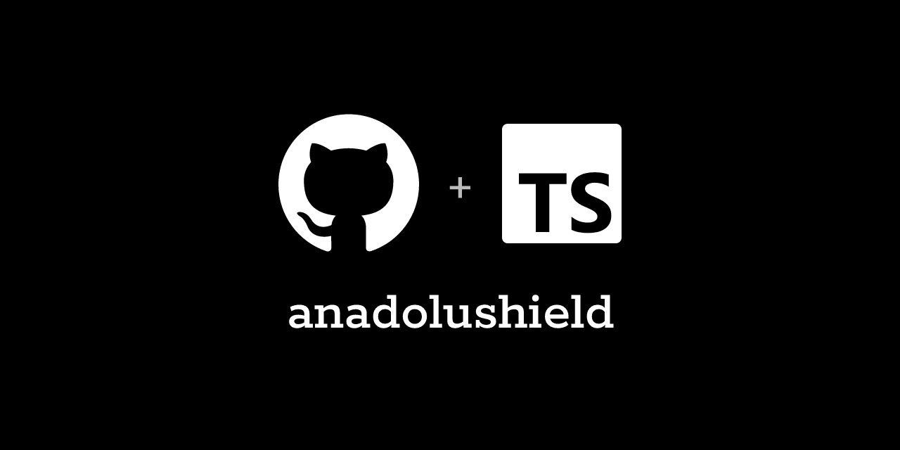

# @voxyfy/anadolushield — Yapay Zeka Servisleri için KVKK Kişisel Veri Maskeleme Kütüphanesi

<p align="center">
  
</p>

**anadolushield**, OpenAI (ChatGPT), Anthropic (Claude) ve Google Gemini gibi
yapay zeka servislerine bir istek göndermeden önce, metnin içindeki Türkçe
kişisel verileri (T.C. kimlik numarası, vergi kimlik numarası, IBAN,
telefon numarası, e-posta, kredi kartı numarası ve isim) otomatik olarak
tespit edip gizleyen; yapay zekadan gelen yanıtı da gerçek bilgilerle geri
tamamlayan, tamamen ücretsiz ve açık kaynaklı bir **Node.js / TypeScript
kütüphanesidir**. Müşteri verisiyle çalışan, KVKK (Kişisel Verilerin
Korunması Kanunu) uyum riskini azaltmak isteyen Türk yazılım ekipleri
için baştan sona Türkçe düşünülerek hazırlandı.

> ⚠️ **Bu kütüphane hukuki bir tavsiye niteliği taşımaz, KVKK uyumluluğunu
> tek başına garanti etmez.** Riski azaltan teknik bir önlemdir — neyi
> yapıp neyi yapmadığını görmek için aşağıdaki [Sınırlamalar](#sınırlamalar)
> bölümünü okuyun.

## Bu kütüphane neden var, hangi soruna çözüm sunuyor?

Bir Türk şirketi, müşteri destek talebini, bir CRM notunu ya da bir
sözleşme metnini olduğu gibi bir yapay zeka servisine (OpenAI, Claude,
Gemini vb.) gönderdiği anda, o metnin içindeki isim, T.C. kimlik numarası,
telefon ya da adres gibi bilgiler hukuken **yurt dışına kişisel veri
aktarımı** sayılabiliyor (KVKK madde 9). Bu yüzden birçok ekip, ürününe
yapay zeka özelliği eklemekten çekiniyor; eklemeye karar verenler ise
sorunu dağınık regex parçalarıyla, elle yazılmış `.replace()` çağrılarıyla
her seferinde yeniden ve tutarsız bir şekilde çözmeye çalışıyor.

`anadolushield`, bu işi tek, test edilmiş bir katmana indiriyor: kütüphane
**hiçbir ağ isteği göndermez, tamamen kendi sunucunuzda/tarayıcınızda
çalışır** — hangi gizli bilginin hangi kod kelimesine karşılık geldiğini
tutan eşleme tablosu hiçbir zaman dışarı çıkmaz, yalnızca sizin kendi
kodunuzdaki `restore()` çağrısında kullanılır.

## Kurulum

```bash
npm install @voxyfy/anadolushield
```

Node.js 18 veya üzeri gerekir. Kurulumla birlikte gelen, dışarıdan hiçbir
ek bağımlılık indirmez.

## Hızlı başlangıç — 30 saniyede kullanım

```ts
import { createAnadoluShield } from '@voxyfy/anadolushield';

const shield = createAnadoluShield();

const { redactedText, restore } = shield.redact(
  'Müşterimiz Ahmet Yılmaz (TCKN: 10000000146) IBAN TR33 0006 1005 1978 6457 8413 26 ' +
    'hesabına para gönderemiyor, telefonu 0532 123 45 67.',
);

console.log(redactedText);
// "Müşterimiz [ISIM_1] (TCKN: [TCKN_1]) IBAN [IBAN_1] hesabına para
//  gönderemiyor, telefonu [TELEFON_1]."

// Bu maskelenmiş metni artık güvenle OpenAI/Claude/Gemini'ye gönderebilirsiniz.
const yapayZekaYaniti = await openai.chat.completions.create({
  messages: [{ role: 'user', content: redactedText }],
});

// Yapay zekadan dönen yanıttaki kod kelimelerini gerçek bilgilerle geri doldurur.
const nihaiYanit = restore(yapayZekaYaniti.choices[0].message.content!);
```

### Örnek 2 — Müşteri destek/chatbot senaryosu

Bir destek talebini yapay zekaya özetletmek isteyen tipik bir akış:

```ts
import { createAnadoluShield } from '@voxyfy/anadolushield';

const shield = createAnadoluShield();

async function destekTalebiniOzetle(musteriMesaji: string) {
  const { redactedText, restore } = shield.redact(musteriMesaji);

  const yanit = await openai.chat.completions.create({
    model: 'gpt-4o-mini',
    messages: [
      { role: 'system', content: 'Aşağıdaki destek talebini iki cümlede özetle.' },
      { role: 'user', content: redactedText },
    ],
  });

  // Özet metninde geçen [ISIM_1] gibi kod kelimeleri, müşterinin gerçek
  // adıyla otomatik olarak değiştirilir.
  return restore(yanit.choices[0].message.content ?? '');
}

const ozet = await destekTalebiniOzetle(
  'Adım Zeynep Kaya, 0532 456 78 90 numaralı telefonumdan iki gündür kargom hakkında bilgi alamıyorum.',
);
```

### Örnek 3 — Express.js middleware olarak kullanmak

Uygulamanızdaki her yapay zeka çağrısında otomatik maskeleme yapmak için
basit bir sarmalayıcı yazabilirsiniz:

```ts
import express from 'express';
import { createAnadoluShield } from '@voxyfy/anadolushield';

const app = express();
const shield = createAnadoluShield();

app.post('/asistan', express.json(), async (req, res) => {
  const { redactedText, restore } = shield.redact(req.body.mesaj);

  const yanit = await openai.chat.completions.create({
    messages: [{ role: 'user', content: redactedText }],
  });

  res.json({ cevap: restore(yanit.choices[0].message.content ?? '') });
});
```

### Örnek 4 — Sadece belirli veri türlerini maskelemek

İsim tespiti diğerlerine göre daha sezgisel çalıştığı için (bkz.
[Sınırlamalar](#sınırlamalar)), isterseniz sadece sayısal/örüntülü
verileri maskeleyip isim tespitini devre dışı bırakabilirsiniz:

```ts
const shield = createAnadoluShield({
  types: ['TCKN', 'VKN', 'IBAN', 'TELEFON', 'EPOSTA', 'KART'],
});
```

### Örnek 5 — Toplu (birden fazla) metni işlemek

```ts
const musteriNotlari = [
  'Ahmet Yılmaz, TCKN 10000000146, ödeme yapamadı.',
  'Zeynep Kaya IBAN bilgisini güncellemek istiyor: TR33 0006 1005 1978 6457 8413 26',
];

const maskelenmisNotlar = musteriNotlari.map((notMetni) => shield.redact(notMetni).redactedText);
```

### Örnek 6 — Hangi kişisel verinin bulunduğunu denetlemek (loglama)

Hangi tür kişisel verinin kaç kez bulunduğunu görmek, denetim/istatistik
amaçlı kullanışlıdır — ama bu bilgiyi (gerçek değerleriyle) **hiçbir zaman
dışarıya, üçüncü bir servise göndermeyin**:

```ts
const { matches } = shield.redact(metin);

console.log(matches);
// [{ type: 'TCKN', value: '10000000146', start: 24, end: 35 }, ...]
```

## Desteklenen kişisel veri türleri

| Tür | Ne yakalar | Nasıl tespit eder | Güvenilirlik |
|---|---|---|---|
| `TCKN` | T.C. Kimlik Numarası | Resmi kontrol basamağı algoritması (2 kontrol hanesi) | Yüksek — rastgele 11 haneli bir sayının yanlışlıkla geçerli çıkma olasılığı ~1/100 |
| `VKN` | Vergi Kimlik Numarası | Resmi kontrol basamağı algoritması (1 kontrol hanesi) | Orta — TCKN'ye göre daha gevşek, yanlışlıkla geçme olasılığı ~1/10 |
| `IBAN` | Banka hesap numarası (IBAN) | ISO 7064 mod-97 (uluslararası, evrensel IBAN kontrolü) | Yüksek |
| `KART` | Kredi/banka kartı numarası | Luhn algoritması (tüm kart ağlarında geçerli evrensel kontrol) | Yüksek |
| `TELEFON` | Türk cep telefonu numarası (05XX / +90 5XX) | Örüntü eşleşmesi | Orta — kontrol basamağı yok |
| `EPOSTA` | E-posta adresi | Standart örüntü eşleşmesi | Orta |
| `ISIM` | Kişi ad-soyadı | ~90 yaygın Türkçe ad listesi + hemen ardından gelen büyük harfli kelime sezgiseli | **En düşük** — aşağıdaki Sınırlamalar bölümüne bakın |

## Sınırlamalar — dürüstçe neyi yapmadığını bilin

- **İsim tespiti gerçek bir yapay zeka/NER (Varlık Tanıma) modeli
  kullanmaz.** Elimizdeki isim listesinde bulunmayan adları (yabancı
  isimler, listede yer almayan Türkçe adlar, tek başına kullanılan isimler)
  **yakalayamaz**. Yüksek hassasiyet gereken senaryolarda `types`
  parametresiyle isim tespitini kapatıp kendi çözümünüzü eklemeniz daha
  güvenli olabilir (yalnız unutmayın: bulut tabanlı bir NER servisi
  kullanmak da başka bir üçüncü tarafa veri göndermek anlamına gelir).
- **VKN tespitinde yanlış pozitif ihtimali gerçektir.** Vergi kimlik
  numarası tek bir kontrol hanesi kullandığı için, rastgele 10 haneli bir
  sipariş kodu veya referans numarası yanlışlıkla vergi kimlik numarası
  sanılabilir. Kütüphane, çakışan eşleşmelerde daha güvenilir türleri
  (IBAN, TCKN, kredi kartı) önceliklendirir ama bu ihtimali sıfıra
  indirmez.
- **Serbest metin adres tespiti şu an desteklenmiyor.** "Moda Caddesi No:5
  Kadıköy" gibi açık adresler henüz maskelenmiyor — bu, aşağıdaki yol
  haritasında ilk sıradaki geliştirme.
- **Bu kütüphane bir hukuki uyumluluk garantisi değildir.** KVKK'nın
  gerektirdiği aydınlatma metni, açık rıza alma, veri işleme envanteri
  tutma gibi diğer yükümlülükler tamamen kapsam dışındadır — sadece
  teknik riski azaltan bir güvenlik katmanıdır.

## Yol haritası

1. Çekirdek tespit ediciler (TCKN, VKN, IBAN, kredi kartı, telefon,
   e-posta, isim) ile `redact()` / `restore()` motoru — ✅ tamamlandı,
   25 birim testi başarıyla geçiyor
2. Serbest metinde geçen açık adreslerin tespiti ve maskelenmesi
3. Kendi tespit edicinizi (özel regex ya da fonksiyon) eklemeye izin veren
   genişletilebilir bir API
4. Akış hâlinde (streaming) gelen yapay zeka yanıtlarında da kod
   kelimelerinin gerçek zamanlı olarak geri doldurulması

## Sıkça sorulan sorular

**Bu kütüphaneyi kullanınca KVKK'ya tam uyumlu olur muyum?**
Hayır. Bu kütüphane riski azaltan bir teknik önlemdir, KVKK'nın tüm
yükümlülüklerini (aydınlatma metni, açık rıza vb.) tek başına karşılamaz.

**Verilerim herhangi bir sunucuya gönderiliyor mu?**
Hayır. Kütüphane tamamen yerelde, kendi sunucunuzda/uygulamanızda çalışır,
hiçbir ağ isteği yapmaz.

**Sadece OpenAI ile mi çalışır?**
Hayır. Kütüphane herhangi bir yapay zeka sağlayıcısına bağlı değildir —
maskelenmiş metni istediğiniz herhangi bir LLM API'sine (OpenAI, Claude,
Gemini, yerel modeller vb.) gönderebilirsiniz.

## İlgili projeler

Aynı ekip tarafından geliştirilen, aynı sade ve tek amaca odaklı yaklaşımla
yazılmış diğer açık kaynak kütüphaneler:

- **[Voxyfy/anadolupay](https://github.com/Voxyfy/anadolupay)** (PHP/Laravel)
  ve **[Voxyfy/anadolupay-node](https://github.com/Voxyfy/anadolupay-node)**
  ([npm](https://www.npmjs.com/package/@voxyfy/anadolupay)) — Türk banka ve
  ödeme sağlayıcıları için tek arayüzlü ödeme kütüphanesi.
- **[Voxyfy/anadoluship](https://github.com/Voxyfy/anadoluship)**
  ([npm](https://www.npmjs.com/package/@voxyfy/anadoluship)) — Türk kargo
  firmaları (MNG, UPS, Yurtiçi, Aras, PTT, Sürat) için tek arayüzlü kargo
  ve gönderi takip kütüphanesi.

## Lisans

MIT
